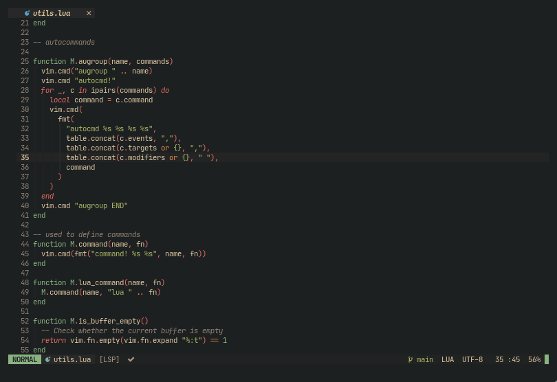
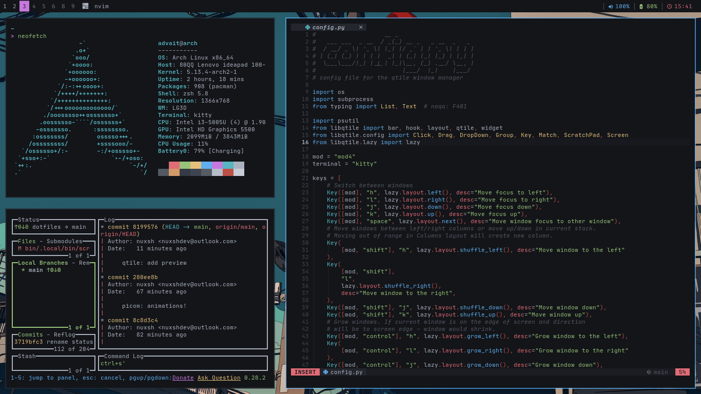
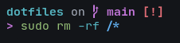

# these are my dotfiles

i use [stow](https://www.gnu.org/software/stow/) to manage them

what's included:

#### `nvim/`
my neovim configuration

#### `qtile/`
my qtile configuration

#### `zsh/`
my zsh config  

#### `bin/`
my collection of scripts with very short names

#### `other/`
this shouldn't bother you. they exist simply to save me some time when im starting from scratch

 
 
im too lazy to list the rest
